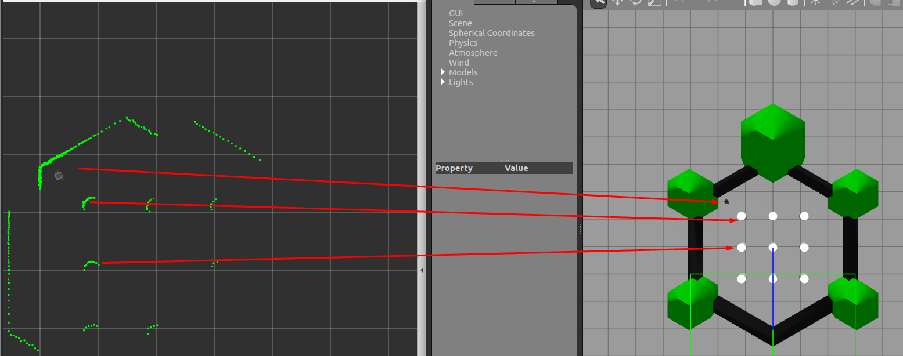
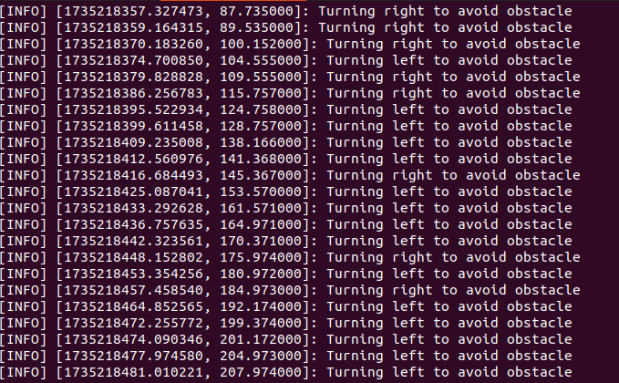

# **TurtleBot3 Simulation and Autonomous Navigation**

This repository contains a comprehensive framework for simulating the TurtleBot3 robot in various environments using ROS (Robot Operating System). It includes configurations, scripts, and tools for autonomous navigation, obstacle avoidance, and environment exploration. The project leverages **Gazebo** for realistic simulation, **RViz** for visualization, and Python-based custom scripts for navigation logic.

---

## **Project Goals**

The primary goal of this project is to simulate a TurtleBot3 robot capable of:
1. **Dynamic Obstacle Avoidance**:
   - Using Lidar sensor data to detect obstacles and adjust the robot's path in real time.
2. **Randomized Exploration**:
   - Allowing the robot to autonomously explore its environment without relying on pre-built maps or SLAM techniques.
3. **Integration with Simulation Tools**:
   - Combining Gazebo and RViz to create a robust testing and visualization environment for robot behavior.

---

## **Packages Overview**

### **1. turtlebot3_fake_node**
This package simulates the TurtleBot3's essential functionalities in a lightweight environment, making it ideal for quick testing and algorithm development without requiring a full physics-based simulation.

#### **Features**:
- Simulates core sensors and actuators of the TurtleBot3.
- Publishes important ROS topics such as `/cmd_vel` for velocity commands and `/scan` for Lidar data.
- Simplified execution compared to a full Gazebo-based simulation.

#### **Key Files**:
- **`turtlebot3_fake_node.launch.py`**:
  - Launches the fake node, initializing a lightweight TurtleBot3 simulation environment.
- **`turtlebot3_fake_node.hpp` / `turtlebot3_fake_node.cpp`**:
  - Implements the core functionalities of the fake node, including topic publishing and sensor simulation.

#### **Usage**:
Run the fake node simulation with the following command:
```bash
roslaunch turtlebot3_fake_node turtlebot3_fake_node.launch.py
```

---

### **2. turtlebot3_gazebo**
The `turtlebot3_gazebo` package provides a full simulation of the TurtleBot3 robot within the Gazebo environment. It includes preconfigured worlds, detailed robot models, and navigation tools.

#### **Features**:
- Provides physics-accurate simulations of the TurtleBot3 (`burger`, `waffle`, and `waffle_pi` models).
- Includes predefined Gazebo worlds such as house and office environments.
- Full integration with navigation tools, enabling obstacle avoidance and goal-based movement.

#### **Key Files**:
- **`waffle.yaml`, `burger.yaml`, `waffle_pi.yaml`**:
  - Configuration files defining model-specific parameters such as sensor ranges and movement capabilities.
- **`move_base.launch`**:
  - Launches the `move_base` node, enabling autonomous navigation and obstacle avoidance within the Gazebo simulation.

#### **Usage**:
To start the Gazebo simulation:
```bash
roslaunch turtlebot3_gazebo turtlebot3_world.launch
```

---

### **3. turtlebot3_simulations**
This package combines the functionalities of the above packages and integrates RViz for visualization. It serves as the central component for running simulation scenarios with both visualization and robot interaction.

#### **Features**:
- Provides complete workflows for simulation and visualization.
- Supports real-time Lidar data visualization, robot trajectory tracking, and dynamic obstacle interaction.
- Offers custom launch files for seamless integration of Gazebo and RViz.

#### **Key Files**:
- **`rviz2.launch.py`**:
  - Launches RViz with preconfigured visualization settings for TurtleBot3, including Lidar data, robot position, and navigation paths.
- **`autonomous_navigation.py`**:
  - Python script for implementing obstacle avoidance and random exploration using Lidar sensor data.

#### **Usage**:
1. Start the RViz visualization:
   ```bash
   roslaunch turtlebot3_simulations rviz2.launch.py
   ```
2. Run the custom navigation script:
   ```bash
   rosrun turtlebot3_simulations autonomous_navigation.py
   ```

---

## **Project Architecture**

This repository is organized as follows:

```
catkin_ws/
├── src/
│   ├── turtlebot3_fake_node/
│   │   ├── launch/
│   │   │   ├── turtlebot3_fake_node.launch.py
│   │   ├── src/
│   │   │   ├── turtlebot3_fake_node.cpp
│   │   │   ├── turtlebot3_fake_node.hpp
│   ├── turtlebot3_gazebo/
│   │   ├── launch/
│   │   │   ├── turtlebot3_world.launch
│   │   ├── config/
│   │   │   ├── waffle.yaml
│   │   │   ├── burger.yaml
│   ├── turtlebot3_simulations/
│   │   ├── scripts/
│   │   │   ├── autonomous_navigation.py
│   │   ├── launch/
│   │   │   ├── rviz2.launch.py
│   ├── CMakeLists.txt
│   ├── package.xml
```

---

## **How to Run the Project**

### **Step 1: Build the Workspace**
Navigate to the root of your workspace and build:
```bash
cd ~/catkin_ws
catkin_make
source devel/setup.bash
```

### **Step 2: Start Simulation**
1. Launch the Gazebo world:
   ```bash
   roslaunch turtlebot3_gazebo turtlebot3_world.launch
   ```

2. Alternatively, launch the lightweight fake node:
   ```bash
   roslaunch turtlebot3_fake_node turtlebot3_fake_node.launch.py
   ```

### **Step 3: Visualize with RViz**
Start RViz for real-time visualization:
```bash
roslaunch turtlebot3_simulations rviz2.launch.py
```

### **Step 4: Run the Navigation Script**
Execute the Python script for autonomous exploration:
```bash
rosrun turtlebot3_simulations autonomous_navigation.py
```
   
   

---

## **Key Features of the Navigation Algorithm**

1. **Obstacle Avoidance**:
   - Processes Lidar data to detect and avoid obstacles dynamically.
   - Adjusts turning angles and speeds based on detected distances.

2. **Random Exploration**:
   - Implements randomized turning behaviors to simulate exploratory movement.
   - Ensures the robot avoids getting stuck in confined spaces.

---

## **Challenges Faced**

1. **Sensor Data Issues**:
   - Erroneous `inf` and `0.0` values in Lidar data caused incorrect navigation.
   - Solution: Filtering invalid data using Python.

2. **Navigation Optimization**:
   - Initial movement parameters led to collisions or slow performance.
   - Solution: Optimized speed and turning dynamics.

3. **Simulation Configuration**:
   - Setting up appropriate frames and configurations for RViz and Gazebo.
   - Solution: Carefully tuned `yaml` and launch files.

---


